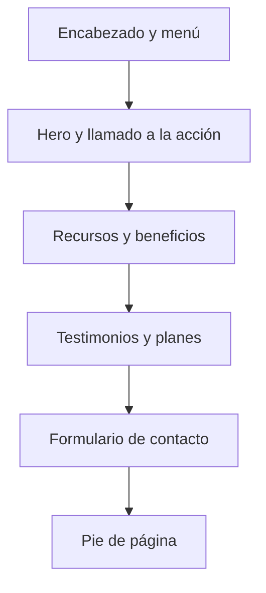
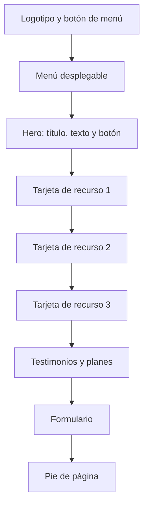

# Boceto de la landing page

Este documento representa la distribución general de las secciones de la landing page para emprendedores y su adaptación a distintos tamaños de pantalla.

## Orden general de las secciones

## Boceto para computadora

| Encabezado |
|---|
| Logotipo a la izquierda y menú de navegación a la derecha |

| Hero |
|---|
| Título principal, descripción y botón de llamado a la acción |

| Recursos y beneficios |
|---|
| Tres tarjetas distribuidas horizontalmente |

| Testimonios y planes |
|---|
| Tarjetas organizadas en columnas |

| Formulario de contacto |
|---|
| Campos de nombre, correo y plan, acompañados del botón de registro |

| Pie de página |
|---|
| Información final y enlaces del sitio |

## Boceto para celular

En dispositivos móviles, todos los elementos se organizan verticalmente para facilitar la lectura y la navegación.

## Comportamiento responsivo

- En celular, las tarjetas aparecen una debajo de otra.
- En tableta, las tarjetas pueden distribuirse en dos columnas.
- En computadora, las tarjetas se muestran en tres columnas.
- El menú se convierte en un botón desplegable en pantallas pequeñas.
- Los textos, botones y formularios se ajustan al ancho disponible.
- Ningún elemento debe salirse horizontalmente de la pantalla.